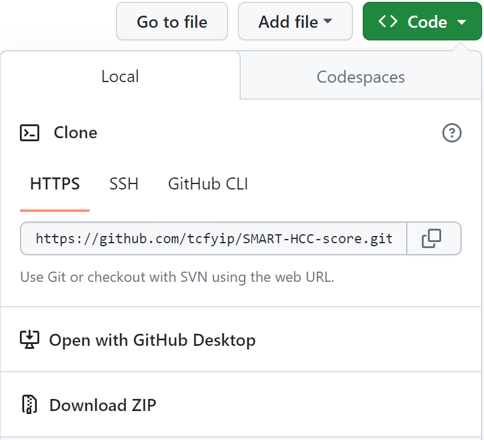

```{r setup, include=FALSE}
knitr::opts_chunk$set(echo = TRUE)
```
For online calculator, please visit <https://tcfyip.shinyapps.io/lsm-xgb_hcc_score/>.

For offline use, you can download all the files from <https://github.com/tcfyip/LSM-XGB-HCC-score>. 
Please click "Code" and then "Download ZIP". {width="30%"}

Then you can put all the downloaded files in the same directory of your local computer and run the following R codes with R installed. Or you may want to fork the whole repository to your GitHub. The R codes have been tested in R v4.0.3 and v4.0.5.

## Required R packages

-   caret (v6.0-92) and its dependencies
-   xgboost (v1.6.0.1)

```{r}
# Uncomment and install R packages 'caret' (v6.0-92) and 'xgboost' (v1.6.0.1) for first time usage
# devtools::install_version("caret", version = "6.0-92", repos = "http://cran.us.r-project.org")
# devtools::install_version("xgboost", version = "1.6.0.1", repos = "http://cran.us.r-project.org")
```

## LSM-XGB HCC score

The following codes calculate the LSM-XGB HCC score for a single patient.

```{r}

# Input the clinical data of a single patient as follows
# Age (years)
Age = 50
# Gender (0: Female, 1: Male)
Gender = 1
# Etiology (0: viral hepatitis, 1: non-viral hepatitis)
Etiology = 0
# Presence of hypertension (1: Yes, 0: No)
HT = 0
# Alanine aminotransferase (IU/L)
ALT = 35
# Alkaline phosphatase (IU/L)
ALP = 57
# Platelet (x10^9/L)
PLT = 220
# Creatinine (μmol/L)
Cr = 70.2
# Liver stiffness measurement (kPa)
LSM = 8.8

# Form a data frame
pt1 = data.frame(
  'Age'=Age, 'Gender'=Gender, 'Etiology'=Etiology, 
  'HT'=HT, 'ALT'=ALT, 'ALP'=ALP, 
  'PLT'=PLT, 'Cr'=Cr, 'LSM'=LSM)

# Load necessary R package
library(caret)

# Calculate LSM-XGB HCC score
m_xgb = readRDS("LSM_XGB_HCC.rds")
score = round(predict(m_xgb, pt1, type="prob")$yes, 3)

paste("The LSM-XGB HCC score is", score)
```

The following codes calculate LSM-XGB HCC score in a cohort of patients.

```{r}

# Remark: The data set should contain the 12 necessary columns:
# Age, Gender, Etiology, DM, HT, ALT, ALB, TB, ALP, PLT, Cr, LSM
# Please refer to above on the units and the coding of the categories

# Read in the cohort of patients in csv format
pts <- read.csv("sample cohort.csv")

# Load necessary R package
library(caret)

# Calculate the LSM-XGB HCC scores
m_xgb = readRDS("LSM_XGB_HCC.rds")
scores = round(predict(m_xgb, pts, type="prob")$yes, 3)

head(cbind(pts, scores), 10)
```
